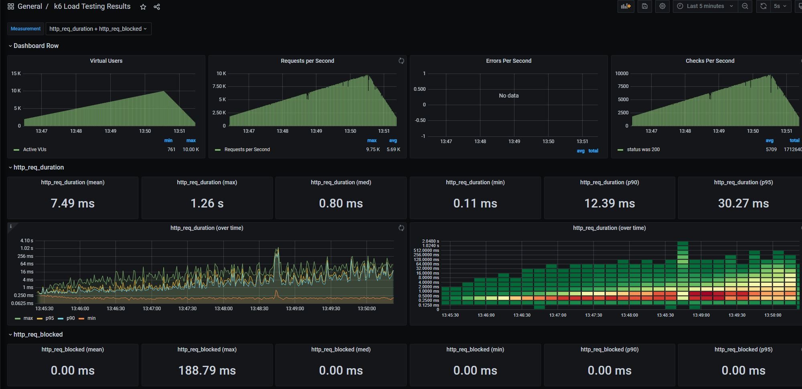

# k6-loadtest

Show how to run load tests with K6, Grafana and InfluxDB.

## Run

Create a .env file with those variables for grafana:

.env file :

```
GF_SECURITY_ADMIN_USER=xxxx
GF_SECURITY_ADMIN_PASSWORD=xxxx
```

Just run :

```
docker-compose up -d
```

open your browser to http://localhost:3000, use your credentials to login grafana
navigate to the dashboard `k6 Load Testing Results`

## Port

| app | local | conteneur |
|-----|-------|-----------|
| grafana  | 3000 | 3000  |
| web  | 3001 | 80  |
| influxdb  | - | 8086  |

## Web

For test purpose the web container is `containous/whoami`

## Test

Stress test of the home page of the web container

- during 30s target 0 user
- during 1m target 20 users
- during 5m target 1000 users
- during 1m target 20 users
- during 30s target 0 user

## Dashboard

Use dashboard based on id 2587 from <https://grafana.com/grafana/dashboards/2587>

## Result


